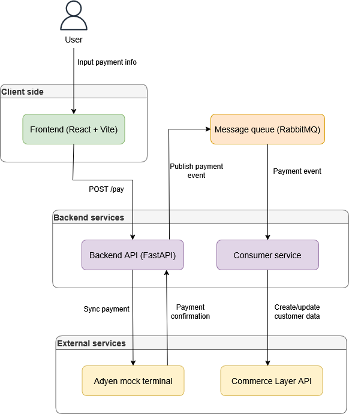

# Digital retail developer assignment - Marimekko POS System

A point-of-sale (POS) assignment for Marimekko pop-up stores, built using a microservice architecture with Docker, FastAPI (Python), React (Vite), and RabbitMQ.

---

## Features

* User-facing frontend to input payment amount, currency, and email
* Backend FastAPI service to process payment and send loyalty events
* Adyen mock terminal to simulate real-world payment processing
* Message queue (RabbitMQ) to decouple services
* Commerce Layer integration to update Unikko points

---

## Prerequisites

* [Docker](https://www.docker.com/)
* Internet connection is required to interact with the Commerce Layer API

---
## Before deployment

Clone this repository to desired location:

```
git clone https://github.com/aaprotu/digital_retail_developer_assignment.git
```

### Setting up Commerce Layer

1. Go to [https://commercelayer.io](https://commercelayer.io) and create a new account  
2. Create a new **organization**  
3. Navigate to **Developers** -> **API Credentials** and select or create integration credential 
4. Copy the **Client ID**, **Client Secret** and **Core API endpoint**
5. Add them to the `.env` file as shown below 


### Setting up Adyen Mock Terminal

This project uses a [custom Adyen mock terminal](https://github.com/aaprotu/adyen-mock-terminal-api-custom) to simulate payment confirmation.

1. Clone the Adyen mock terminal repository as a **sibling** to this repo:

    ```
    git clone https://github.com/aaprotu/adyen-mock-terminal-api-custom.git
    ```

2. Your directory structure should look like this:

    ```
    your-folder/
    ├── digital_retail_developer_assignment/
    └── adyen-mock-terminal-api-custom/
    ```

3. The `docker-compose.yml` will automatically build the terminal from the sibling directory.  


### Environment variables (example `.env`)

Add your own credentials as shown below

```env
CL_CLIENT_ID=your_commercelayer_client_id
CL_CLIENT_SECRET=your_commercelayer_client_secret
CL_API_URL=your_commercelayer_core_api_endpoint
CL_AUTH_URL=https://auth.commercelayer.io/oauth/token
ADYEN_TERMINAL_URL=http://adyen:3000/sync
```

---

## Running the application

Navigate to the project root and make sure Docker is running:

```
docker-compose up --build
```

Services will be available at:

* Frontend: [http://localhost:4173](http://localhost:4173)
* Backend API: [http://localhost:8000](http://localhost:8000)
* Adyen mock terminal: [http://localhost:3000](http://localhost:3000)
* RabbitMQ dashboard: [http://localhost:15672](http://localhost:15672) (user: guest / guest)

---

## Usage

1. Go to [http://localhost:4173](http://localhost:4173)
2. Enter email, amount, and select currency
3. Submit payment
4. Payment is sent to the mock Adyen terminal
5. Go to [http://localhost:3000](http://localhost:3000) and enter 4 digit pin
6. On success, Unikko points are calculated and pushed to RabbitMQ
7. The consumer receives the event and creates or updates customers data via Commerce Layer API

---

## System Architecture

This project follows an event-driven microservices architecture:

- **Frontend (React + Vite):** Provides a simple UI for inputting email, payment amount, and currency. Sends the data as a POST request to the backend.
- **Backend (FastAPI):** Receives payment requests from the frontend, forwards them to the Adyen mock terminal, calculates Unikko loyalty points upon confirmation, and publishes events to RabbitMQ.
- **Adyen Mock Terminal:** Simulates a real payment terminal where the user confirms the transaction using a 4-digit PIN.
- **RabbitMQ:** Acts as a message broker to decouple services and enable asynchronous event-based communication.
- **Consumer Service (FastAPI):** Subscribes to RabbitMQ events and handles post-payment actions, such as loyalty point updates, by calling operations defined in `commerce_layer.py`.
- **Commerce Layer:** External API that acts as the source of truth for customer profiles and Unikko point balances. All interactions are handled through the `commerce_layer.py` integration module.

 



---

### Testing

To run the unit tests, make sure you have pytest and pytest-httpx installed and you're in the project root. Then execute:
```set PYTHONPATH=.```

and run the tests with
```pytest```